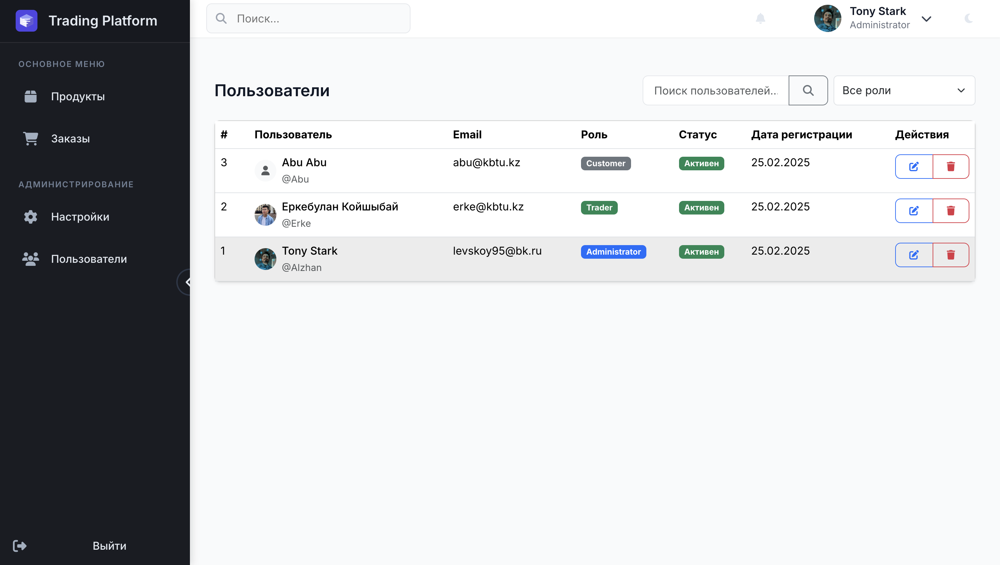
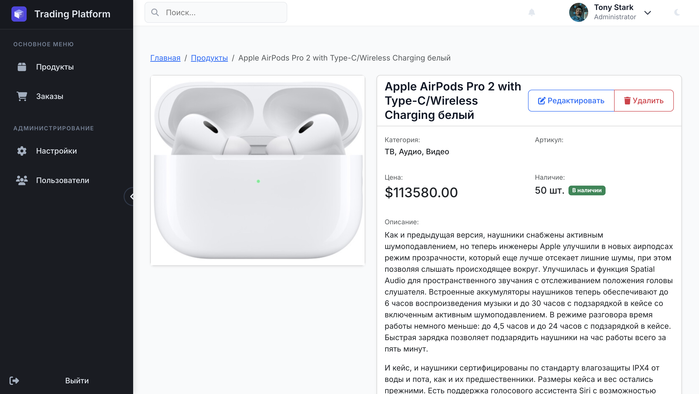
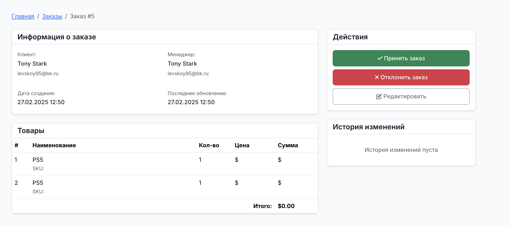
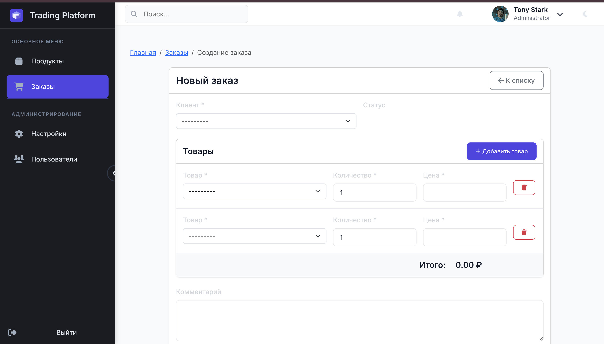
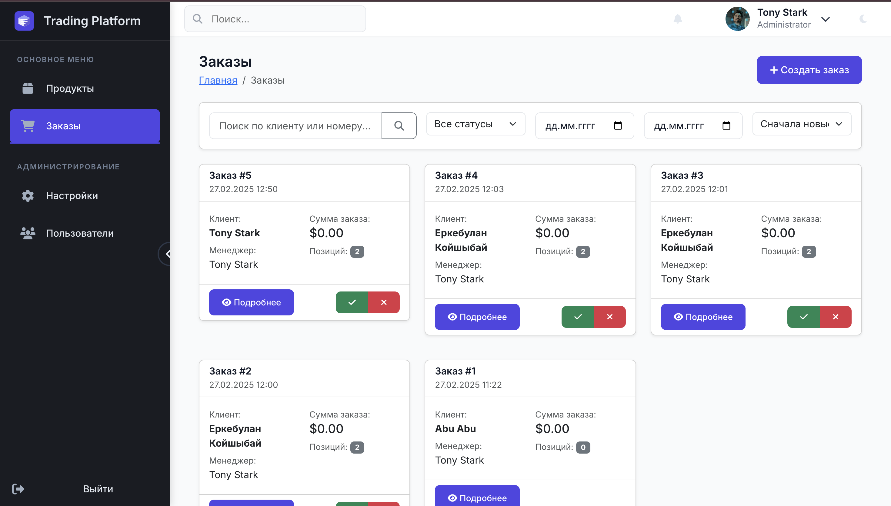
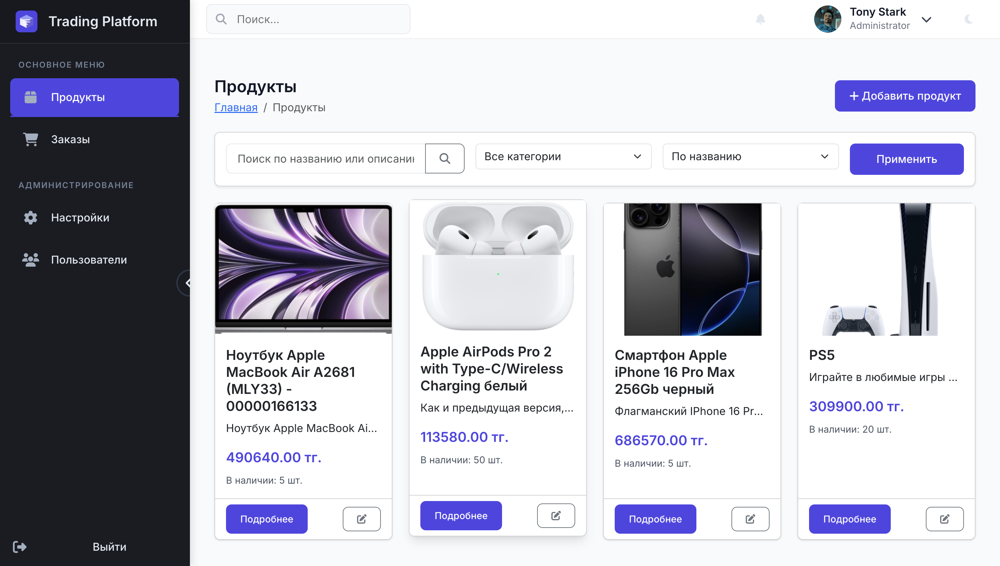
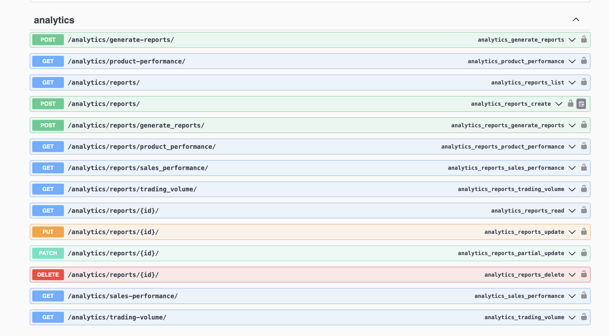
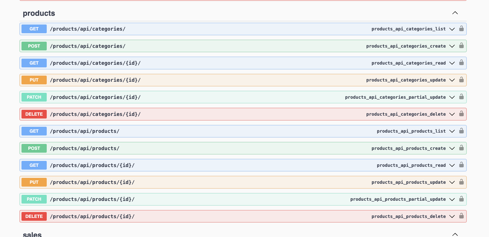
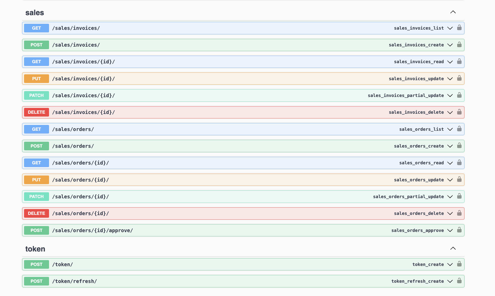
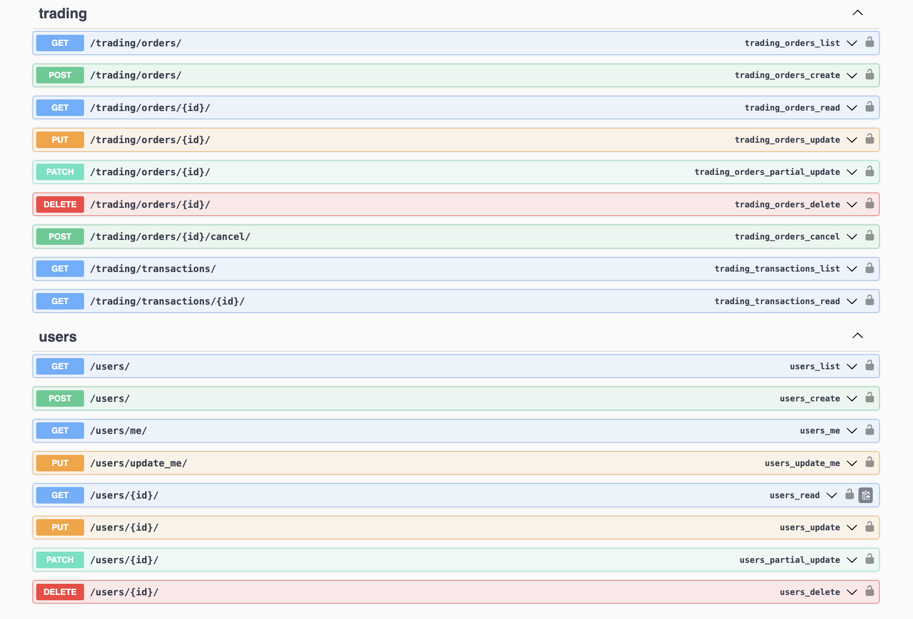

# Bazar-service 🛍️

## Демо
- Живая версия: [Bazar-service](https://dolphin-app-zscjm.ondigitalocean.app/)


##  Описание проекта
Bazar-service - современная платформа электронной коммерции, предоставляющая пользователям возможность легко покупать и продавать товары. Наше приложение сочетает в себе интуитивно понятный интерфейс с мощной функциональностью для эффективного ведения онлайн-торговли.

## Основные возможности

### 👥 Для пользователей
- Регистрация и авторизация через email/пароль или социальные сети
- Личный кабинет с историей заказов и избранными товарами
- Корзина покупок с сохранением между сессиями

<div align="center">
  
  

</div>

### 🏪 Для продавцов
- Управление каталогом товаров
- Аналитика продаж и статистика
- Обработка заказов и управление статусами
- Система уведомлений о новых заказах

<div align="center">
  
  
  

</div>

## 📊 Скриншоты

<div align="center">
  
  
  
  
</div>

## 🛠 Технологический стек

### Backend
- **Framework**: Django 4.2
- **API**: Django REST Framework
- **База данных**: PostgreSQL
- **Кеширование**: Redis
- **Очереди**: Celery
- **Поиск**: Elasticsearch

### Frontend
- **Шаблонизация**: Django Templates
- **Стили**: SCSS
- **JavaScript**: ES6+
- **Сборка**: Webpack

### Инфраструктура
- **Контейнеризация**: Docker
- **CI/CD**: GitHub Actions
- **Хостинг**: DigitalOcean
- **Хранение файлов**: AWS S3
- **Мониторинг**: Sentry

## 🚀 Установка и запуск

### Предварительные требования
- Python 3.9+
- PostgreSQL 13+
- Redis
- Django 
- DRF
- Deploy

### Локальная установка

1. Клонировать репозиторий:
```bash
git clone https://github.com/Alzhandar/Bazar-service.git
cd Bazar-service
```

2. Создать виртуальное окружение и установить зависимости:
```bash
python -m venv venv
source venv/bin/activate  # для Linux/macOS
venv\Scripts\activate  # для Windows
pip install -r requirements.txt
```

3. Настроить переменные окружения:
```bash
cp .env.example .env
# Отредактируйте .env файл, добавив необходимые значения
```

4. Применить миграции и создать суперпользователя:
```bash
python manage.py migrate
python manage.py createsuperuser
```

5. Запустить проект:
```bash
python manage.py runserver
```

### Docker установка

```bash
docker-compose up -d
```


## 🙏 Благодарности

- Нашим пользователям за отзывы и предложения

<div align="center">
  <sub>Built with ❤️ by Alzhandar</sub>
</div>